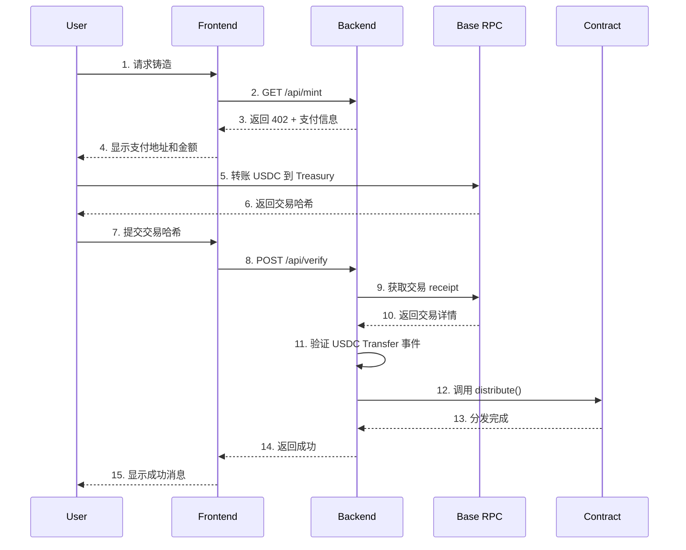

# LICODE x402 Token Minting System

<div align="center">

[](https://soliditylang.org/)
[](https://base.org/)
[](LICENSE)

**完整的区块链代币铸造系统，基于 Base 网络实现 x402 支付验证模式**

[功能特性](#-功能特性) • [快速开始](#-快速开始) • [部署指南](#-部署指南) • [文档](#-文档) • [技术架构](#-技术架构)

</div>

---

## 📋 目录

- [项目简介](#-项目简介)
- [功能特性](#-功能特性)
- [技术栈](#-技术栈)
- [快速开始](#-快速开始)
- [部署指南](#-部署指南)
  - [合约部署](#1-智能合约部署)
  - [后端部署](#2-后端服务部署)
  - [前端部署](#3-前端应用部署)
- [项目结构](#-项目结构)
- [核心流程](#-核心流程)
- [配置说明](#-配置说明)
- [文档](#-文档)
- [运维指南](#-运维指南)
- [安全考虑](#-安全考虑)

---

## 🎯 项目简介

LICODE x402 是一个基于 Base 区块链的全栈代币铸造系统，实现了创新的 **x402 支付验证模式**。用户通过支付 USDC 来铸造 LICODE 代币，整个过程通过智能合约和后端验证系统确保安全可靠。

### 核心机制

- **固定兑换率**：默认 1 USDC = 5,000 LICODE
- **双重限额保护**：总量限额 + 单钱包限额
- **链上支付验证**：后端验证 USDC 转账后自动分发代币
- **安全的分发模式**：采用 Distributor 模式，代币由合约托管

---

## ✨ 功能特性

### 智能合约
- ✅ ERC-20 标准代币实现
- ✅ Distributor 授权分发模式
- ✅ 双重限额机制（总量 + 单钱包）
- ✅ 所有者提取功能（用于流动性池）
- ✅ 安全的权限管理

### 后端服务
- ✅ HTTP 402 支付协议实现
- ✅ 链上交易验证
- ✅ USDC Transfer 事件扫描
- ✅ 自动代币分发
- ✅ Redis 防重放攻击
- ✅ 速率限制保护
- ✅ CORS 跨域支持
- ✅ 健康检查端点

### 前端应用
- ✅ Next.js 14 + TypeScript
- ✅ 钱包连接（wagmi）
- ✅ 三种支付方式：
  - 手动提交交易哈希
  - 扫描 QR 码支付
  - 钱包直接转账
- ✅ 实时统计数据展示
- ✅ 响应式设计

---

## 🛠 技术栈

### 智能合约
- Solidity 0.8.24
- OpenZeppelin 5.0
- Hardhat 2.22

### 后端
- Node.js + TypeScript
- Express 4.19
- ethers.js 6.10
- Redis (可选，用于防重放)
- express-rate-limit

### 前端
- Next.js 14.2
- React 18
- wagmi 2.13
- viem 2.9
- TanStack Query 5.59

---

## 🚀 快速开始

### 前置要求

- Node.js >= 18.x
- pnpm >= 8.x
- Git
- Redis (生产环境推荐)

### 安装依赖

```bash
# 克隆项目
git clone <repository-url>
cd x402mint-main

# 安装根目录依赖（智能合约）
pnpm install

# 安装后端依赖
cd backend
pnpm install

# 安装前端依赖
cd ../frontend
pnpm install

cd ..
```

### 本地开发（测试网）

#### 1. 配置环境变量

**根目录 `.env`**:
```bash
cp .env.example .env
# 编辑 .env，填写测试网配置
```

**后端 `backend/.env`**:
```bash
cd backend
cp .env.example .env
# 编辑 backend/.env，填写后端配置
```

**前端 `frontend/.env.local`**:
```bash
cd frontend
cp .env.example .env.local
# 编辑 frontend/.env.local，填写前端配置
```

#### 2. 编译合约

```bash
pnpm build
```

#### 3. 部署到测试网

```bash
# 部署到 Base Sepolia
pnpm run deploySepolia
```

记录输出的合约地址，更新到 `backend/.env` 和 `frontend/.env.local`。

#### 4. 启动后端服务

```bash
cd backend
pnpm run dev
# 服务运行在 http://localhost:3001
```

#### 5. 启动前端应用

```bash
cd frontend
pnpm run dev
# 访问 http://localhost:3000
```

---

## 📦 部署指南

### 1. 智能合约部署

详细步骤请查看：[**合约部署指南**](docs/deployment/contract-deployment.md)

#### 快速部署流程

```bash
# 1. 配置环境变量
cp .env.example .env
# 编辑 .env，填写以下关键信息：
# - DEPLOYER_PRIVATE_KEY（需要有 ETH）
# - OWNER_ADDRESS
# - DISTRIBUTOR_ADDRESS
# - 代币参数（可选，有默认值）

# 2. 编译合约
pnpm build

# 3. 部署（选择网络）
pnpm run deploySepolia  # 测试网
# 或
pnpm run deploy         # 主网

# 4. 验证合约（可选）
TOKEN_ADDRESS=0x... pnpm run verify
```

#### 关键配置参数

| 参数 | 说明 | 默认值 |
|------|------|--------|
| `DEPLOYER_PRIVATE_KEY` | 部署者私钥（需要 ETH） | - |
| `OWNER_ADDRESS` | 合约所有者地址 | - |
| `DISTRIBUTOR_ADDRESS` | 分发者地址（后端 EOA） | - |
| `TOTAL_SUPPLY_18` | 代币总供应量 | 1000000000 (10亿) |
| `TOKENS_PER_USDC_18` | 兑换率 | 5000 |
| `TOTAL_USDC_CAP_6` | 总 USDC 限额 | 100000000000 (10万) |
| `PER_WALLET_USDC_CAP_6` | 单钱包限额 | 10000000 (10 USDC) |

### 2. 后端服务部署

详细步骤请查看：[**后端部署指南**](docs/deployment/backend-deployment.md)

#### 配置环境变量

```bash
cd backend
cp .env.example .env
```

编辑 `backend/.env`:

```bash
# 必需配置
RPC_URL_BASE="https://mainnet.base.org"
TOKEN_ADDRESS="0x合约地址"           # 步骤1部署的地址
USDC_ADDRESS="0x833589fCD6eDb6E08f4c7C38f3dCF7E808A7C366"  # Base 主网 USDC
TREASURY_ADDRESS="0x收款地址"        # 接收用户 USDC 的地址
DISTRIBUTOR_PRIVATE_KEY="0x..."     # 对应合约中的 DISTRIBUTOR_ADDRESS
MINT_USDC_6="1000000"               # 1 USDC
CHAIN_ID="8453"                     # Base 主网

# 安全配置（生产环境必需）
REDIS_URL="redis://localhost:6379"
ENABLE_CORS="true"
ENABLE_RATE_LIMIT="true"
FRONTEND_URL="https://your-domain.com"
```

#### 启动服务

**开发环境**:
```bash
pnpm run dev
```

**生产环境**:
```bash
# 使用 PM2
pnpm install -g pm2
pnpm run build
pm2 start dist/server.js --name licode-backend

# 或使用 Docker
docker build -t licode-backend .
docker run -d -p 3001:3001 --env-file .env licode-backend
```

### 3. 前端应用部署

详细步骤请查看：[**前端部署指南**](docs/deployment/frontend-deployment.md)

#### 配置环境变量

```bash
cd frontend
cp .env.example .env.local
```

编辑 `frontend/.env.local`:

```bash
NEXT_PUBLIC_CHAIN_ID=8453
NEXT_PUBLIC_TOKEN_ADDRESS="0x合约地址"
NEXT_PUBLIC_USDC_ADDRESS="0x833589fCD6eDb6E08f4c7C38f3dCF7E808A7C366"
NEXT_PUBLIC_TREASURY_ADDRESS="0x收款地址"
NEXT_PUBLIC_MINT_USDC="1"  # 用户界面显示
```

#### 构建和部署

**Vercel 部署** (推荐):
```bash
pnpm install -g vercel
vercel --prod
```

**传统服务器部署**:
```bash
pnpm run build
pnpm start
# 或使用 PM2
pm2 start npm --name licode-frontend -- start
```

---

## 📁 项目结构

```
x402mint-main/
├── contracts/              # 智能合约
│   └── LicodeToken.sol    # 主合约文件
├── scripts/               # 部署和管理脚本
│   ├── deploy.ts          # 合约部署脚本
│   ├── verify.ts          # 合约验证脚本
│   └── withdraw.ts        # 代币提取脚本
├── backend/               # 后端服务
│   ├── src/
│   │   └── server.ts      # Express 服务器
│   ├── package.json
│   └── .env.example
├── frontend/              # 前端应用
│   ├── app/
│   │   ├── page.tsx       # 主页面
│   │   ├── providers.tsx  # Web3 Provider
│   │   └── layout.tsx     # 布局
│   ├── package.json
│   └── .env.example
├── docs/                  # 文档目录
│   ├── deployment/        # 部署文档
│   ├── security/          # 安全文档
│   ├── architecture/      # 架构文档
│   └── guides/            # 使用指南
├── .env.example           # 环境变量示例
├── hardhat.config.ts      # Hardhat 配置
├── package.json
└── README.md              # 本文件
```

---

## 🔄 核心流程

### 用户铸造代币流程



### 关键步骤说明

1. **支付请求**：前端向后端请求铸造信息
2. **HTTP 402 响应**：后端返回支付详情（金额、地址）
3. **用户转账**：用户向 Treasury 地址转账 USDC
4. **提交验证**：用户提交交易哈希到后端
5. **链上验证**：后端获取交易 receipt，验证 Transfer 事件
6. **检查限额**：验证总量和单钱包限额
7. **分发代币**：后端调用合约 `distribute()` 方法
8. **完成铸造**：用户收到 LICODE 代币

---

## ⚙️ 配置说明

### 网络配置

| 网络 | Chain ID | RPC URL | USDC 地址 |
|------|----------|---------|-----------|
| Base Mainnet | 8453 | https://mainnet.base.org | `0x833589fCD6eDb6E08f4c7C38f3dCF7E808A7C366` |
| Base Sepolia | 84532 | https://sepolia.base.org | `0x036CbD53842c5426634e7929541eC2318f3dCF7e` |

### 重要地址说明

- **DEPLOYER_ADDRESS**: 部署合约的地址，需要 ETH 支付 gas
- **OWNER_ADDRESS**: 合约所有者，可以调用 `ownerWithdraw()` 和 `setDistributor()`
- **DISTRIBUTOR_ADDRESS**: 后端服务的 EOA 地址，可以调用 `distribute()`
- **TREASURY_ADDRESS**: 接收用户 USDC 支付的地址

### 精度说明

- **LICODE 代币**：18 位小数（标准 ERC-20）
- **USDC**：6 位小数
- **合约存储**：以 6 位小数记录 USDC 金额
- **转换公式**：`tokens = (usdcAmount6 * tokensPerUsdc) / 1e6`

---

## 📚 文档

### 部署文档
- [合约部署指南](docs/deployment/contract-deployment.md) - 详细的合约部署步骤
- [后端部署指南](docs/deployment/backend-deployment.md) - 后端服务部署和配置
- [前端部署指南](docs/deployment/frontend-deployment.md) - 前端应用部署
- [部署验证指南](docs/deployment/部署验证指南.md) - 部署后的验证流程

### 安全文档
- [安全加固指南](docs/security/安全加固部署指南.md) - 生产环境安全配置
- [安全校验分析](docs/security/安全校验分析.md) - 安全审计要点
- [权限配置指南](docs/security/权限配置指南.md) - 角色和权限管理

### 架构文档
- [技术架构文档](docs/architecture/licode_x_402_mint_prd_full_stack_scaffold.md) - 完整的技术架构说明

### 使用指南
- [功能完整性检查](docs/guides/功能完整性检查.md) - 功能测试清单

---

## 🔧 运维指南

### 更换 Distributor

如果需要更换后端分发账户：

```bash
# 1. 使用 Hardhat Console
npx hardhat console --network base

# 2. 连接合约
const token = await ethers.getContractAt("LicodeToken", "0x合约地址")

# 3. 调用 setDistributor（需要 Owner 权限）
await token.setDistributor("0x新Distributor地址")

# 4. 更新后端环境变量
# 编辑 backend/.env 中的 DISTRIBUTOR_PRIVATE_KEY

# 5. 重启后端服务
```

### 提取代币到流动性池

使用 `withdraw.ts` 脚本提取代币：

```bash
# 1. 在根目录 .env 中配置
WITHDRAW_TO_ADDRESS=0x目标地址
WITHDRAW_AMOUNT_18=1000000  # 100万代币
TOKEN_ADDRESS=0x合约地址

# 2. 运行脚本（需要 Owner 权限）
npx hardhat run scripts/withdraw.ts --network base
```

### 监控和日志

**后端健康检查**:
```bash
curl http://localhost:3001/health
```

返回信息包括：
- Redis 连接状态
- RPC 节点状态
- 当前区块高度
- Distributor 余额

**查看后端日志**:
```bash
# PM2
pm2 logs licode-backend

# Docker
docker logs -f <container-id>
```

### 常见问题排查

**问题 1: Distributor 余额不足**
```bash
# 解决方案：向 Distributor 地址充值 ETH
# 建议保持余额 >= 0.1 ETH
```

**问题 2: Redis 连接失败**
```bash
# 检查 Redis 状态
redis-cli ping

# 启动 Redis
brew services start redis  # macOS
sudo systemctl start redis # Linux
```

**问题 3: USDC 地址错误**
```bash
# 确认使用正确网络的 USDC 地址
# Base 主网: 0x833589fCD6eDb6E08f4c7C38f3dCF7E808A7C366
# Base Sepolia: 0x036CbD53842c5426634e7929541eC2318f3dCF7e
```

---

## 🔒 安全考虑

### 生产部署前检查清单

- [ ] **私钥安全**
  - [ ] 使用环境变量存储私钥
  - [ ] 不要提交私钥到版本控制
  - [ ] DEPLOYER 和 DISTRIBUTOR 使用不同地址
  - [ ] OWNER 使用硬件钱包或多签

- [ ] **后端安全**
  - [ ] 启用 Redis 防重放攻击
  - [ ] 启用速率限制 (`ENABLE_RATE_LIMIT=true`)
  - [ ] 配置 CORS (`FRONTEND_URL`)
  - [ ] 使用 HTTPS（Nginx/Cloudflare）
  - [ ] Distributor 账户有足够 ETH

- [ ] **合约安全**
  - [ ] 在测试网完整测试
  - [ ] 验证合约源码
  - [ ] 检查限额配置合理性
  - [ ] USDC 地址正确无误

- [ ] **监控和备份**
  - [ ] 配置监控和告警
  - [ ] 备份关键配置文件
  - [ ] 准备应急预案

### 关键安全机制

1. **双重限额保护**
   - 合约层强制执行总量和单钱包限额
   - 后端预检查，节省 gas

2. **防重放攻击**
   - Redis 记录已处理的交易哈希
   - 防止同一笔交易被多次处理

3. **速率限制**
   - 每个 IP 5 次/分钟
   - 防止暴力攻击

4. **权限分离**
   - Owner: 只能提取代币和更换 Distributor
   - Distributor: 只能分发代币
   - 两者不托管代币，只需要 gas

---

## 📞 支持和贡献

### 获取帮助

- 查看 [文档目录](docs/)
- 提交 [Issue](../../issues)

### 开发规范

```bash
# 运行测试
pnpm test

# 代码格式化
pnpm format

# 类型检查
pnpm typecheck
```

---

## 📄 License

MIT License - 详见 [LICENSE](LICENSE) 文件

---

## 🙏 致谢

- [OpenZeppelin](https://openzeppelin.com/) - 安全的智能合约库
- [Hardhat](https://hardhat.org/) - 以太坊开发环境
- [Base](https://base.org/) - Layer 2 区块链网络
- [Next.js](https://nextjs.org/) - React 框架
- [wagmi](https://wagmi.sh/) - React Hooks for Ethereum

---

<div align="center">

**⭐ 如果这个项目对你有帮助，请给它一个 Star！**

Made with ❤️ by LICODE Team

</div>
