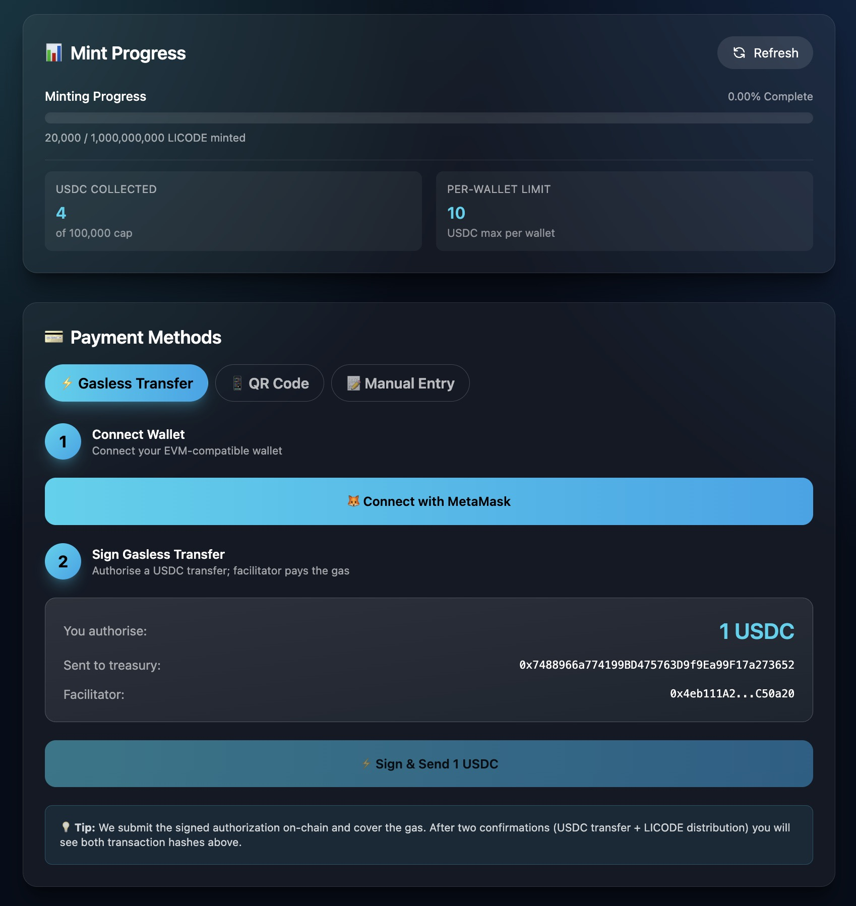
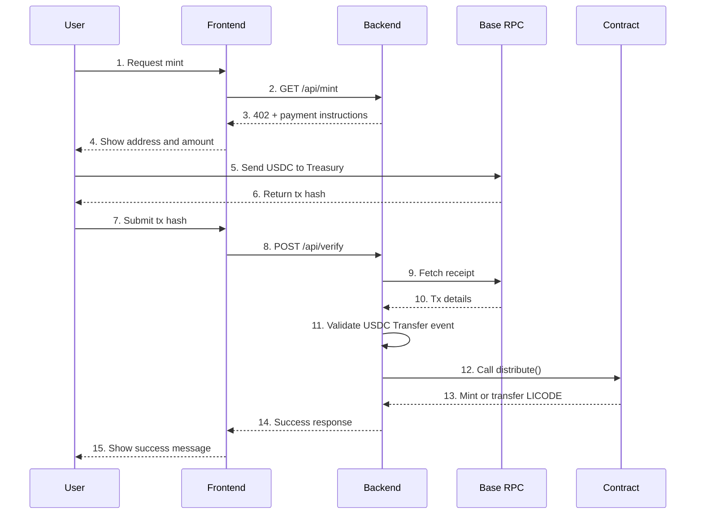

# x402 Token Minting System

<div align="center">

[](https://soliditylang.org/)
[](https://base.org/)
[](LICENSE)

**A full-stack token minting system on Base implementing the x402 payment verification pattern.**

_完整的 Base 网络代币铸造全栈脚手架，实现 x402 支付校验模式。_

</div>

---



---

## 📋 Table of Contents

- [Overview](#-overview)
- [Features](#-features)
- [Tech Stack](#-tech-stack)
- [Quick Start](#-quick-start)
- [Deployment](#-deployment)
  - [Smart Contracts](#1-smart-contract-deployment)
  - [Backend](#2-backend-deployment)
  - [Frontend](#3-frontend-deployment)
- [Project Structure](#-project-structure)
- [Core Flow](#-core-flow)
- [Configuration](#-configuration)
- [Documentation](#-documentation)
- [Ops & Maintenance](#-ops--maintenance)
- [Security](#-security)
- [中文说明](#-中文说明)

---

## 🎯 Overview

LICODE x402 is a full-stack token minting system built on the Base network. It implements an **x402 payment verification pattern**, where users pay in USDC and receive LICODE tokens, with the whole process secured end-to-end by smart contracts and a verification backend.

### Core Mechanics

- Fixed exchange rate – default `1 USDC = 5,000 LICODE`
- Dual cap protection – global cap plus per-wallet cap
- On-chain payment verification – backend verifies USDC transfers before minting
- Safe distribution model – Distributor pattern with tokens held in the contract

---

## ✨ Features

### Smart Contracts

- ERC-20 token implementation
- Distributor-based authorized distribution
- Dual cap logic (total supply plus per wallet)
- Owner withdrawal for liquidity provisioning
- Minimal and explicit roles and permissions

### Backend Service

- HTTP 402 payment protocol flow
- On-chain transaction verification
- USDC `Transfer` event scanning
- Automatic token distribution via `distribute()`
- Redis-based replay protection
- Rate limiting
- CORS support
- Health check endpoint

### Frontend App

- Next.js 14 plus TypeScript
- Wallet connection via wagmi and viem
- Three payment flows:
  - Manually submit transaction hash
  - Pay via QR code
  - Direct wallet transfer
- Realtime stats display
- Responsive layout

---

## 🛠 Tech Stack

### Smart Contracts

- Solidity 0.8.24
- OpenZeppelin 5.x
- Hardhat 2.22

### Backend

- Node.js plus TypeScript
- Express 4.19
- ethers.js 6.x
- Redis (optional, recommended in production)
- express-rate-limit

### Frontend

- Next.js 14.2
- React 18
- wagmi 2.x
- viem 2.x
- TanStack Query 5.x

---

## 🚀 Quick Start

### Prerequisites

- Node.js 18 or newer
- pnpm 8 or newer
- Git
- Redis (recommended for testnet, required for production)

### Install Dependencies

```bash
# Clone
git clone <repository-url>
cd x402-mint

# Root deps (contracts and tooling)
pnpm install

# Backend
cd backend
pnpm install

# Frontend
cd ../frontend
pnpm install
```

### Local Development (Testnet)

#### 1. Environment Variables

Root `.env`:

```bash
cp .env.example .env
# Edit .env to point to your Base testnet RPC and deployment keys.
```

Backend `backend/.env`:

```bash
cd backend
cp .env.example .env
# Edit backend/.env with contract addresses and RPC settings.
```

Frontend `frontend/.env.local`:

```bash
cd ../frontend
cp .env.example .env.local
# Edit frontend/.env.local with chain id and contract addresses.
```

#### 2. Compile Contracts

```bash
pnpm build
```

#### 3. Deploy to Testnet

```bash
# Deploy to Base Sepolia
pnpm run deploySepolia
```

Copy the emitted token address into `backend/.env` and `frontend/.env.local`.

#### 4. Start Backend

```bash
cd backend
pnpm run dev
# http://localhost:3001
```

#### 5. Start Frontend

```bash
cd ../frontend
pnpm run dev
# http://localhost:3000
```

---

## 📦 Deployment

### 1. Smart Contract Deployment

Full guide: `docs/deployment/contract-deployment.md`.

#### One-shot Deployment

```bash
cp .env.example .env
# Edit .env with:
# - DEPLOYER_PRIVATE_KEY (with gas on Base)
# - OWNER_ADDRESS
# - DISTRIBUTOR_ADDRESS
# - Token parameters (optional; defaults are provided)

pnpm build

# Testnet
pnpm run deploySepolia

# Mainnet
pnpm run deploy

# Optional: verify
TOKEN_ADDRESS=0x... pnpm run verify
```

#### Key Parameters

| Env var                 | Description                             | Default             |
|-------------------------|-----------------------------------------|---------------------|
| `DEPLOYER_PRIVATE_KEY`  | Deployer private key (needs gas)        | -                   |
| `OWNER_ADDRESS`         | Contract owner                          | -                   |
| `DISTRIBUTOR_ADDRESS`   | Distributor EOA (backend signer)        | -                   |
| `TOTAL_SUPPLY_18`       | Token total supply (18 decimals)        | `1000000000`        |
| `TOKENS_PER_USDC_18`    | Exchange rate (18 decimals)             | `5000`              |
| `TOTAL_USDC_CAP_6`      | Global USDC cap (6 decimals)            | `100000000000`      |
| `PER_WALLET_USDC_CAP_6` | Per-wallet USDC cap (6 decimals)        | `10000000` (10 USD) |

### 2. Backend Deployment

Full guide: `docs/deployment/backend-deployment.md`.

#### Environment

```bash
cd backend
cp .env.example .env
```

Edit `backend/.env`:

```bash
RPC_URL_BASE="https://mainnet.base.org"
TOKEN_ADDRESS="0xYourToken"          # from step 1
USDC_ADDRESS="0x833589fcd6edb6e08f4c7c32d4f71b54bda02913"  # Base mainnet USDC
TREASURY_ADDRESS="0xTreasury"        # receives user USDC
DISTRIBUTOR_PRIVATE_KEY="0x..."      # must match DISTRIBUTOR_ADDRESS
MINT_USDC_6="1000000"                # 1 USDC
CHAIN_ID="8453"                      # Base mainnet

# Security (production)
REDIS_URL="redis://localhost:6379"
ENABLE_CORS="true"
ENABLE_RATE_LIMIT="true"
FRONTEND_URL="https://your-domain.com"
```

#### Run

Development:

```bash
pnpm run dev
```

Production with PM2:

```bash
pnpm run build
pnpm install -g pm2
pm2 start dist/server.js --name licode-backend
```

Or Docker:

```bash
docker build -t licode-backend .
docker run -d -p 3001:3001 --env-file .env licode-backend
```

### 3. Frontend Deployment

Full guide: `docs/deployment/frontend-deployment.md`.

#### Environment

```bash
cd frontend
cp .env.example .env.local
```

Edit `frontend/.env.local`:

```bash
NEXT_PUBLIC_CHAIN_ID=8453
NEXT_PUBLIC_TOKEN_ADDRESS="0xYourToken"
NEXT_PUBLIC_USDC_ADDRESS="0x833589fcd6edb6e08f4c7c32d4f71b54bda02913"
NEXT_PUBLIC_TREASURY_ADDRESS="0xTreasury"
NEXT_PUBLIC_MINT_USDC="1"
```

#### Build and Run

Vercel (recommended):

```bash
pnpm install -g vercel
vercel --prod
```

Node server:

```bash
pnpm run build
pnpm start
# or
pm2 start npm --name licode-frontend -- start
```

---

## 📁 Project Structure

```text
x402-mint/
├── contracts/              # Solidity contracts
│   └── LicodeToken.sol     # Main token contract
├── scripts/                # Hardhat scripts
│   ├── deploy.ts
│   ├── verify.ts
│   └── withdraw.ts
├── backend/                # Backend service
│   ├── src/
│   │   └── server.ts       # Express server
│   ├── package.json
│   └── .env.example
├── frontend/               # Frontend app
│   ├── app/
│   │   ├── page.tsx
│   │   ├── providers.tsx
│   │   └── layout.tsx
│   ├── package.json
│   └── .env.example
├── docs/                   # Documentation
│   ├── deployment/
│   ├── security/
│   ├── architecture/
│   └── guides/
├── images/
│   └── image.png           # Demo screenshot
├── .env.example
├── hardhat.config.ts
├── package.json
└── README.md
```

---

## 🔄 Core Flow

User mint flow:



---

## ⚙️ Configuration

### Network

| Network       | Chain ID | RPC URL                  | USDC address                                 |
|--------------|----------|--------------------------|----------------------------------------------|
| Base Mainnet | 8453     | https://mainnet.base.org | `0x833589fcd6edb6e08f4c7c32d4f71b54bda02913` |
| Base Sepolia | 84532    | https://sepolia.base.org | `0x036CbD53842c5426634e7929541eC2318f3dCF7e` |

### Important Addresses

- `DEPLOYER_ADDRESS` – deploys contracts, pays gas
- `OWNER_ADDRESS` – can call `ownerWithdraw()` and `setDistributor()`
- `DISTRIBUTOR_ADDRESS` – backend EOA that calls `distribute()`
- `TREASURY_ADDRESS` – receives user USDC payments

### Decimals and Math

- LICODE token: 18 decimals (standard ERC-20)
- USDC: 6 decimals
- USDC values stored as 6-decimal integers in the contract
- Conversion: `tokens = (usdcAmount6 * tokensPerUsdc) / 1e6`

---

## 📚 Documentation

- `docs/deployment/contract-deployment.md` – contract deployment
- `docs/deployment/backend-deployment.md` – backend deployment
- `docs/deployment/frontend-deployment.md` – frontend deployment
- `docs/deployment/部署验证指南.md` – post-deployment checks
- `docs/security/安全加固部署指南.md` – production security hardening
- `docs/security/安全校验分析.md` – security analysis
- `docs/security/权限配置指南.md` – roles and permissions
- `docs/architecture/licode_x_402_mint_prd_full_stack_scaffold.md` – architecture
- `docs/guides/功能完整性检查.md` – functional test checklist

---

## 🔧 Ops and Maintenance

### Rotate Distributor

```bash
npx hardhat console --network base
const token = await ethers.getContractAt("LicodeToken", "0xToken")
await token.setDistributor("0xNewDistributor")  # owner only
```

Then update `DISTRIBUTOR_PRIVATE_KEY` in `backend/.env` and restart the backend.

### Withdraw Tokens to Liquidity

```bash
# In root .env
WITHDRAW_TO_ADDRESS=0xTarget
WITHDRAW_AMOUNT_18=1000000
TOKEN_ADDRESS=0xToken

npx hardhat run scripts/withdraw.ts --network base
```

### Monitoring

Health:

```bash
curl http://localhost:3001/health
```

Output includes Redis status, RPC status, current block height, and distributor balance.

Logs:

```bash
pm2 logs licode-backend
# or
docker logs -f <container-id>
```

---

## 🔒 Security

### Pre-production Checklist

- Keys
  - Use environment variables or a secret manager for private keys.
  - Never commit keys to version control.
  - Separate deployer, owner, and distributor accounts.
  - Prefer hardware wallet or multi-sig for owner.

- Backend
  - Enable Redis replay protection.
  - Enable rate limiting (`ENABLE_RATE_LIMIT=true`).
  - Configure CORS (`FRONTEND_URL`).
  - Serve behind HTTPS (Nginx, Cloudflare, and similar).
  - Ensure distributor has sufficient ETH for gas.

- Contracts
  - Fully test on testnet.
  - Verify source code on explorer.
  - Double-check caps and token economics.
  - Validate USDC address per network.

- Monitoring
  - Set up logs and alerts.
  - Backup critical configuration files.

---

## 🤝 Contributing and Support

- See the docs under `docs/`.
- Open issues or suggestions via your Git hosting platform.

Development helpers:

```bash
pnpm test       # tests
pnpm format     # formatting
pnpm typecheck  # type checking
```

---

## 📄 License

MIT – see `LICENSE`.

---

## 🙏 Credits

- [OpenZeppelin](https://openzeppelin.com/)
- [Hardhat](https://hardhat.org/)
- [Base](https://base.org/)
- [Next.js](https://nextjs.org/)
- [wagmi](https://wagmi.sh/)

---

## 🇨🇳 中文说明

下面是简体中文版本的简介和使用说明，内容与英文版保持一致，便于中文用户快速上手。

### 项目概览

LICODE x402 是一个部署在 Base 区块链上的代币铸造全栈系统，实现了 **x402 支付校验模式**。用户通过支付 USDC 获得 LICODE 代币，整个流程由智能合约和后端服务共同保证安全与合规。

核心机制：

- 固定兑换率：默认 `1 USDC = 5,000 LICODE`
- 双重限额：总额度加单钱包限额
- 链上支付校验：后端校验 USDC 转账后再触发代币分发
- Distributor 分发模式：代币托管在合约中，由指定账号调用 `distribute()` 分发

### 功能特性

- 智能合约
  - 标准 ERC-20 实现
  - Distributor 授权分发
  - 总量与单地址双重限额
  - Owner 提币（用于流动性等场景）
  - 明确的角色与权限管理

- 后端服务
  - HTTP 402 支付协议流程
  - 基于 ethers 的链上交易校验
  - USDC `Transfer` 事件扫描
  - 自动调用合约分发代币
  - Redis 防重放
  - 速率限制与 CORS 支持
  - 健康检查接口

- 前端应用
  - Next.js 14 和 TypeScript
  - 基于 wagmi/viem 的钱包连接
  - 支持三种支付方式：手动提交哈希、扫码支付、直接转账
  - 实时统计与状态展示
  - 响应式界面

### 快速开始（本地测试网）

1. 安装依赖

```bash
git clone <repository-url>
cd x402-mint
pnpm install
cd backend && pnpm install
cd ../frontend && pnpm install
```

2. 配置环境变量

```bash
cp .env.example .env              # 根目录
cd backend && cp .env.example .env
cd ../frontend && cp .env.example .env.local
```

根据实际 RPC、合约地址等修改三个环境变量文件。

3. 编译并部署合约

```bash
pnpm build
pnpm run deploySepolia   # 部署到 Base Sepolia
```

将部署输出的合约地址写入 `backend/.env` 与 `frontend/.env.local`。

4. 启动服务

```bash
cd backend && pnpm run dev        # http://localhost:3001
cd ../frontend && pnpm run dev    # http://localhost:3000
```

### 网络与地址

- Base 主网（ChainId: 8453）
  - RPC: `https://mainnet.base.org`
  - USDC: `0x833589fcd6edb6e08f4c7c32d4f71b54bda02913`
- Base Sepolia（ChainId: 84532）
  - RPC: `https://sepolia.base.org`
  - USDC: `0x036CbD53842c5426634e7929541eC2318f3dCF7e`

重要地址说明：

- `DEPLOYER_ADDRESS`：部署合约地址，需要支付 gas
- `OWNER_ADDRESS`：Owner 地址，可调用 `ownerWithdraw()` 和 `setDistributor()`
- `DISTRIBUTOR_ADDRESS`：后端使用的 EOA，负责调用 `distribute()`
- `TREASURY_ADDRESS`：接收用户 USDC 的地址

### 精度与兑换公式

- LICODE：18 位小数
- USDC：6 位小数
- 合约以内置 6 位精度记录 USDC
- 兑换公式：`tokens = (usdcAmount6 * tokensPerUsdc) / 1e6`

### 运维与安全要点

- 启用 Redis 与速率限制，防止重放与暴力请求
- 区分部署者、Owner、Distributor 三类账号，降低单点风险
- 在测试网充分验证后再部署主网，并在区块浏览器上验证源码
- 正确配置 CORS 和 HTTPS，避免明文传输敏感数据

更多细节请参考仓库 `docs/` 目录中的部署、安全和架构文档。

---

如果这个项目对你有帮助，欢迎 Star 支持。

